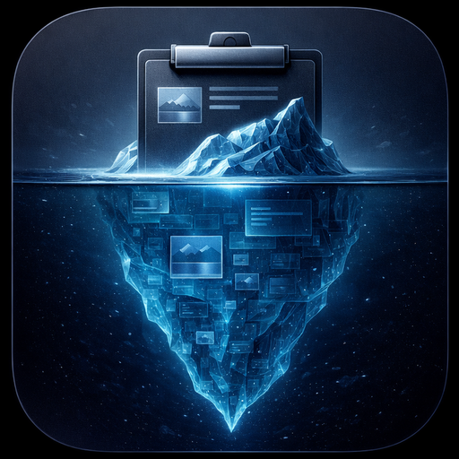
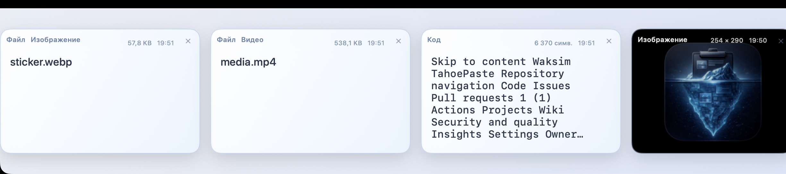
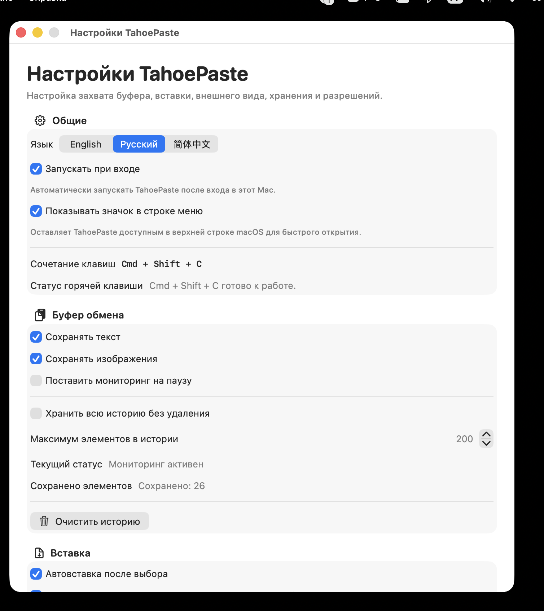

# TahoePaste

<p align="center">
  
</p>

<p align="center">
  A polished, local-only clipboard manager for macOS Tahoe and Windows 11.
</p>

<p align="center">
  <a href="https://github.com/Waksim/TahoePaste/releases">
    
  </a>
  
  
  
  
</p>

<p align="center">
  TahoePaste runs quietly in the background, keeps clipboard history on-device, and brings it back through a fast card-based overlay built for quick paste workflows.
</p>

<p align="center">
  
</p>

<p align="center">
  <sub>Keyboard-first clipboard overlay with large cards, quick scanning, and fast restore back into your workflow.</sub>
</p>

## Why TahoePaste

TahoePaste is designed for people who copy constantly and want a clipboard manager that feels native instead of bolted on. It focuses on speed, clarity, and privacy:

- local-only clipboard storage in the platform's user app data directory
- support for text, links, code, images, and files
- quick keyboard-driven access through a bottom overlay
- native theming with day, night, follow-system, and scheduled modes
- multilingual interface in English, Russian, and Simplified Chinese

## Highlights

| Feature | What it gives you |
| --- | --- |
| Smart clipboard capture | Saves text, links, code, images, and file references with useful metadata and tagging. |
| Fast overlay UI | Press `Cmd + Shift + C` on macOS or `Ctrl + Shift + C` on Windows to open a clean card grid. |
| Rich text tagging | Detects practical text patterns like emails, phone numbers, passwords, tokens, dates, and addresses. |
| Native appearance controls | Switch between day and night themes manually, sync with the OS, or run automatic theme schedules. |
| Background workflow | Keep TahoePaste available from the macOS menu bar or Windows system tray. |
| Privacy-first design | Clipboard history stays on-device with no cloud sync or remote processing. |

## Interface

### Clipboard Overlay

<p align="center">
  
</p>

### Settings Window

<p align="center">
  
</p>

<p align="center">
  <sub>Native settings window with multilingual UI, launch-at-login, appearance controls, and clipboard behavior tuning.</sub>
</p>

## Download

The easiest way to try TahoePaste is from the latest GitHub release:

| Platform | Asset | Direct latest link |
| --- | --- | --- |
| macOS Tahoe | `TahoePaste-macOS.dmg` | [Download DMG](https://github.com/Waksim/TahoePaste/releases/latest/download/TahoePaste-macOS.dmg) |
| Windows 11 x64 installer | `TahoePaste-Windows-x64-Setup.exe` | [Download Setup](https://github.com/Waksim/TahoePaste/releases/latest/download/TahoePaste-Windows-x64-Setup.exe) |
| Windows 11 x64 portable | `TahoePaste-Windows-x64.zip` | [Download ZIP](https://github.com/Waksim/TahoePaste/releases/latest/download/TahoePaste-Windows-x64.zip) |
| Checksums | `SHA256SUMS.txt` | [Download checksums](https://github.com/Waksim/TahoePaste/releases/latest/download/SHA256SUMS.txt) |

You can also browse all builds on the [Releases](https://github.com/Waksim/TahoePaste/releases) page.

## Quick Start

1. Copy text, code, images, or files in any app.
2. Press `Cmd + Shift + C` on macOS or `Ctrl + Shift + C` on Windows.
3. Browse the overlay and pick the item you want.
4. TahoePaste restores it to the clipboard and can auto-paste it back into the previous app.

## App Behavior

- macOS history lives in `~/Library/Application Support/TahoePaste/`
- Windows history lives in `%APPDATA%\TahoePaste\`
- Persisted images are stored in each platform's `Images` subdirectory
- macOS automatic paste depends on Accessibility permission
- Windows automatic paste uses `SendInput`; elevated/admin target apps may require manual `Ctrl + V`
- A stable installed copy is expected at `~/Applications/TahoePaste.app` for reliable macOS permission handling

## Development

### macOS Requirements

1. Install full Xcode at `/Applications/Xcode.app`
2. Point developer tools at Xcode if needed:

```bash
sudo xcode-select -s /Applications/Xcode.app/Contents/Developer
```

3. Install XcodeGen if needed:

```bash
brew install xcodegen
```

### macOS: Generate The Xcode Project

```bash
cd /Users/mk/PycharmProjects/TahoePaste
xcodegen generate
```

This regenerates `TahoePaste.xcodeproj` from `project.yml`.

### macOS: Run In Xcode

1. Open `/Users/mk/PycharmProjects/TahoePaste/TahoePaste.xcodeproj`
2. Select the `TahoePaste` scheme
3. Pick your personal team if Xcode asks for local signing
4. Build and run the app

### macOS: Stable Dev Install

For Accessibility permission, a stable app path works better than Xcode's transient build products:

```bash
cd /Users/mk/PycharmProjects/TahoePaste
./scripts/dev-install-and-run.sh
```

This script:

- builds the app
- installs it to `~/Applications/TahoePaste.app`
- stops the previous TahoePaste process
- launches the refreshed copy

### macOS: Command-Line Build

```bash
cd /Users/mk/PycharmProjects/TahoePaste
DEVELOPER_DIR=/Applications/Xcode.app/Contents/Developer xcodebuild \
  -project TahoePaste.xcodeproj \
  -scheme TahoePaste \
  -configuration Debug \
  build
```

### macOS: Tests

```bash
cd /Users/mk/PycharmProjects/TahoePaste
DEVELOPER_DIR=/Applications/Xcode.app/Contents/Developer xcodebuild \
  -project TahoePaste.xcodeproj \
  -scheme TahoePaste \
  -configuration Debug \
  test
```

### macOS: Build A DMG

```bash
cd /Users/mk/PycharmProjects/TahoePaste
./scripts/build-dmg.sh
```

This produces `dist/TahoePaste.dmg`.

For public distribution beyond local sharing, you will eventually want:

- an Apple Developer ID Application certificate
- notarization
- stapling for the final DMG

### Windows Requirements

- Windows 11 x64
- .NET 10 SDK
- Visual Studio 2026, Rider, or another current .NET desktop editor

### Windows: Run

```powershell
cd C:\Path\To\TahoePaste\windows
.\scripts\run.ps1
```

### Windows: Publish

```powershell
cd C:\Path\To\TahoePaste\windows
.\scripts\build.ps1 -Configuration Release
```

This produces a self-contained `win-x64` app under `windows/src/TahoePaste.Windows/bin/Release/.../publish`.

### GitHub Release Builds

Pushing a tag like `v1.1.0` runs `.github/workflows/release.yml`. The workflow builds:

- `TahoePaste-macOS.dmg`
- `TahoePaste-Windows-x64.zip`
- `TahoePaste-Windows-x64-Setup.exe`
- `SHA256SUMS.txt`

All artifacts are uploaded to the same GitHub Release.

## Project Layout

- `TahoePaste/`: app sources, views, managers, assets, localization, and window controllers
- `TahoePasteTests/`: unit tests for persistence, search, classification, settings, and localization coverage
- `windows/`: Windows 11 app sources, WPF views, Win32 interop, installer config, and PowerShell scripts
- `.github/workflows/release.yml`: cross-platform GitHub Release automation
- `docs/RELEASING.md`: release checklist and signing notes
- `docs/images/`: README visuals such as the app icon and screenshots
- `scripts/dev-install-and-run.sh`: stable local install and relaunch flow
- `scripts/build-dmg.sh`: release `.dmg` packaging

## Privacy

TahoePaste is built around a simple rule: your clipboard history stays on your device. The app stores data locally, works offline, and does not depend on remote services to classify or restore clipboard content.
